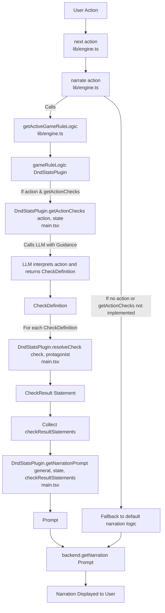

```mermaid
graph TD
    A[User Action] --> B[next action
lib/engine.ts]
    B --> C[narrate action
lib/engine.ts]

    C -- Calls --> D[getActiveGameRuleLogic
lib/engine.ts]
    D --> E[gameRuleLogic DndStatsPlugin]

    E -- If action & getActionChecks --> F[DndStatsPlugin.getActionChecks action, state
main.tsx]
    F -- Calls LLM with Guidance --> G[LLM interprets action and returns CheckDefinition]
    G --> H[CheckDefinition]

    H -- For each CheckDefinition --> I[DndStatsPlugin.resolveCheck check, protagonist
main.tsx]
    I --> J[CheckResult Statement]
    J --> K[Collect checkResultStatements]

    K --> L[DndStatsPlugin.getNarrationPrompt general, state, checkResultStatements
main.tsx]
    L --> M[Prompt]

    M --> N[backend.getNarration Prompt]
    N --> O[Narration Displayed to User]

    C -- If no action or getActionChecks not implemented --> P[Fallback to default narration logic]
    P --> N
```